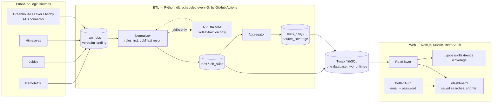

# Hunterrr

**Live: https://hunterrr.vercel.app** · **Source: https://github.com/Srijan1419/hunterrr**

**A personal job-hunting tool.** GitHub Actions collects postings from company job boards
every few hours into Postgres (Neon), extracts structured fields with fixed rules first and
AI only for what is still unknown, and a private web app (Next.js on Vercel, one Google
account allowed) shows entry-level jobs ranked by fit with your profile, with an application
tracker.

> **Status (2026-10-06):** this README is mid-rewrite. The sections below describe the first
> version, a public analytics dashboard on Turso, which has been retired. They stay as design
> history until the portfolio rewrite replaces them.

## Why this project

Most portfolio projects that touch job data stop at "here's a table of postings." This
one is built the way a data engineer would actually be asked to build it: a fixed
normalization ladder that only reaches for an LLM after deterministic rules have failed,
a data contract that both the pipeline and the web app code against so the two runtimes
can't silently drift apart, and — the part most projects skip — a `/coverage` page that
publishes exactly how much of each source resolved, how much didn't, and why.

That last part came out of a real finding: public remote-job aggregators systematically
under-represent the Indian market. RemoteOK resolves India for 4 of 99 postings in a
capture window; Jobicy and Himalayas resolve zero in their default pages. That's not a
bug in this pipeline — it's a measured property of the sources themselves, and this
project reports it rather than smoothing it into a chart that implies otherwise. A
dashboard that says "here's what we don't know, and here's why" is a more interesting
thing to hand an interviewer than one that pretends completeness it doesn't have.

## Architecture



Two deployables, one database. The ETL is the only writer; the web app is a pure read
path plus two small, auth-gated writes (saved searches, shortlist). Neither runtime
guesses at the other's schema — both code against the same documented data contract
(`docs/data-model.md` and `web/db/v2/schema.ts`), and if the contract and a task ever disagreed, the contract
won.

**Normalization is a fixed ladder, not a model call.** For every field: try the source's
own structured field first, then a deterministic rule (a curated country-alias table,
an ordered seniority keyword ladder), and only call the LLM for the residue — skill
extraction from free text, which no source provides structurally. `unknown` is always a
legal answer; the pipeline never guesses a value it can't support. NVIDIA's free tier
caps out around 40 requests/minute account-wide, so a `content_hash` cache means an
unchanged posting is never re-sent to a model twice.

## Product surface

| Route | What it shows | Auth |
|---|---|---|
| `/` | Market overview | Public |
| `/jobs` | Search and filter by country, seniority, role type, skill, source | Public |
| `/jobs/[id]` | Full posting detail with extracted skills, source-tagged vs. LLM-derived | Public |
| `/skills` | In-demand skills, filterable, pay where disclosed | Public |
| `/trends` | Posting volume over time, by source, by day of week | Public |
| `/coverage` | The data-quality page — postings, pay-disclosure rate, and structured-seniority availability per source per country, plus how much of each feed resolved a country at all | Public |
| `/dashboard` | Saved searches and a shortlist | Signed in |

**Two honesty rules run through every page, enforced by the type system rather than by
convention** (`ChartCard`'s `postingCount` prop is required, not optional — a chart
cannot render on this site without stating how many postings are behind it):

1. Every filter and every chart shows the posting count behind it.
2. Every pay statistic shows its disclosure rate next to it. "Pay disclosed on 16% of
   Remote OK postings" is a more honest sentence than a salary chart with no caveat, and
   it survives an interviewer's first follow-up question.

## Running it locally

**ETL** — Python 3.11+. The default test run needs no API key and no network:

```bash
pip install -r etl/requirements.txt
python -m pytest etl/tests -q -m "not live"
```

The real runs are `python -m etl.run collect --shard 0/8`, `python -m etl.run process` and
`python -m etl.run recheck`. They read `DATABASE_URL` (Postgres, schema `hunterrr`) and, for the
AI extraction step, `NVIDIA_API_KEY` / `GROQ_API_KEY`. GitHub Actions runs them on a schedule
(`collect.yml`, `process.yml`).

**Web** — Node 22+:

```bash
cd web
npm install
npm run check      # typecheck + tests, in-memory Postgres, no live database needed
npm run dev
```

A real deployment needs `DATABASE_URL`, `BETTER_AUTH_SECRET`, `BETTER_AUTH_URL`, `ALLOWED_EMAIL`,
`GOOGLE_CLIENT_ID` and `GOOGLE_CLIENT_SECRET` (plus `GROQ_API_KEY` / `NVIDIA_API_KEY` for résumé
reading) — see `web/.env.example`. This README is rewritten properly in the portfolio phase.

## Data sources and attribution

RemoteOK, Jobicy, and Himalayas are ingested via their public, no-key, no-login JSON
APIs. Greenhouse, Lever, and Ashby postings come through a generic ATS connector — one
module per platform, not per company — against a small seed list of verified company
boards. No source that requires logging into a personal account is scraped by this
project.

Remote OK's API terms require a visible, followed attribution link on every page as a
condition of continued access; that link is in this site's footer. Full attribution
text, license obligations for `dlt` and `Better Auth`, and the reasoning behind
deferring `Crawl4AI` are in [`NOTICE`](./NOTICE).

## Testing philosophy

`etl/`: pytest, and the acceptance bar is that it passes with no network and no API key.
Fixtures are small, real captured payloads from all three sources, including the
degenerate cases actually observed (blank location, `salary_min == 0`, multi-country
strings, Himalayas' numeric timezone-offset lists). LLM calls in tests run against a
scripted transport, never the network.

`web/`: Vitest is the only default gate. Playwright is available but deliberately not
required — browser tests on a free CI tier are too slow to keep the build loop fast, and
the trade favors deterministic, always-passing coverage of the layer where the real
logic lives over end-to-end coverage of a UI that changes shape more often.

## Honest limitations

- **India coverage is thin across every source measured**, not just this pipeline: 4 of
  99 RemoteOK postings, 0 of 200 on Jobicy's default page, 0 of 20 on Himalayas' default
  page (Himalayas' own search endpoint surfaces 5,917 of a 97,976-posting feed when
  queried directly for India — the gap is a default-fetch-window problem on their side,
  not a resolution failure on ours, which is exactly the distinction `/coverage`'s
  fetch-window figures exist to make visible).
- **Pay disclosure is sparse and uneven**: 16% on RemoteOK, 59% on Jobicy, 10% on
  Himalayas in the measured baseline. Every pay figure on this site is shown with its
  disclosure rate for exactly this reason.
- **RemoteOK serves a fixed rolling window of its newest ~100 postings**, not a
  paginated full feed — its window-to-feed ratio is not a sampling rate and is labeled
  as such.
- **The scheduled pipeline has not run against a live Turso database yet.** Provisioning
  a real Turso instance and wiring the resulting credentials into GitHub Actions secrets
  is the one step between "fully built and tested offline" and "live in production" —
  see `.github/workflows/cron.yml`.
- **Greenhouse/Lever/Ashby postings carry no structured seniority, pay, or timezone
  field on any of the three boards** — all three default to a rules/LLM resolution path
  like every other under-structured source, never a silent guess.

## Repo topology

This project was built as a subfolder of a larger internal repository (a small
multi-agent dev-org simulation) so it could reuse that repository's task and
verification loop during development. Before deployment it is split into its own
public repository with `git subtree split --prefix=hunterrr`, which carries this
folder's commit history and none of the surrounding content.

## License

MIT — see [`LICENSE`](./LICENSE). Third-party attributions and obligations are in
[`NOTICE`](./NOTICE).
