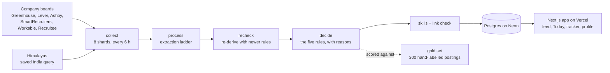

# Hunterrr

**Live: https://hunterrr.vercel.app** (invite-only) · **Source: https://github.com/Srijan1419/hunterrr**

**An early-career basecamp for Indian freshers.** Hunterrr finds remote, full-time, entry-level jobs
that a person in India can actually take, tells you why each one is on your list, ranks them against
your skills, and tracks your applications. The goal is a short time from first use to first interview.

It is not a job board. A board shows everything and leaves the checking to you. Hunterrr hides what
you cannot take and says so about what it is unsure of.

## The rules it never bends

Every job in the main list passes all of these. When the data is silent, the answer is "not eligible",
and supply is grown by finding more sources, never by loosening a rule.

1. **Remote only.** Hybrid and on-site roles are not shown.
2. **A person in India can take it.** The posting names India or a region that contains it, or says
   worldwide and asks for no US/UK/EU work authorisation, clearance or citizenship.
3. **Full-time.** No internships, part-time, volunteer or temporary roles. Contract is allowed and labelled.
4. **Entry level.** Senior titles and a stated minimum of 3 or more years are hidden. 1–2 years is "worth a shot".
5. **A real, open job.** Fee-asking, unpaid, commission-only, "talent pool" and campus-ambassador postings,
   expired postings and dead apply links are hidden.

Jobs that are remote and entry level but do not say whether India may apply sit in a separate, clearly
labelled "unconfirmed" view, never mixed into the main list.

## How it works



- **Collect** polls each job board politely (per-host pacing, stop on 429) and stores the raw posting.
- **Process** extracts fields with a fixed ladder: structured data in the page, then the board's own fields,
  then fixed rules, and an AI step only for what is still unknown. Every field remembers where it came from.
- **Decide** (`etl/decide`) turns the five rules into stored decisions with a plain-language reason, so the web
  app only reads them.
- **Skills** (`config/skills.yaml`) are matched in each posting and in your profile with the same dictionary;
  the score explains matched and missing skills.
- **The gold set** (`etl/fixtures/gold`) is 300 real postings labelled by hand. `python -m etl.run eval` scores
  the pipeline against them, and CI fails if precision on what is shown drops below 95%.
- **Privacy**: a profile and a tracker belong to one person. Every personal query filters on the signed-in user,
  and `web/tests/privacy` proves that user A never sees user B's data.

More detail: [`docs/architecture.md`](docs/architecture.md) and [`docs/data-model.md`](docs/data-model.md).

## Where the jobs come from

| Source | How | Notes |
|---|---|---|
| ~120 company boards | Greenhouse, Lever, Ashby (and a few others) public job APIs | Mostly global companies; few are open to India, so India-heavy companies are added over time with `python -m etl.run discover "Company"` |
| Himalayas | Public search API, one saved query (India, entry level, full-time, remote) | Shown as "via Himalayas". An empty country list is treated as silence, not "worldwide", because 4 of 17 such jobs were wrong in a hand check |

Sources that need a personal login are not scraped. See [`NOTICE`](NOTICE) for attributions and terms.

## Honest numbers (2026-10-07)

- About 14,000 open postings collected; about 3,000 are remote; **222 pass all five rules** in the main list,
  and about 130 more sit in the unconfirmed view.
- Of the roughly 2,700 remote jobs on company boards, about 1,200 are US-only and under 100 are open to India,
  mostly senior. That is the real shape of remote supply for India, and it is why Himalayas is the main source.
- On the hand-labelled set the main list is 97% precise on postings used to tune the rules and 100% on postings
  the rules have never seen (small sample, 7 shown). Recall is lower by design: a job that is not clearly open to
  India stays out.

## Run it

**ETL** (Python 3.11+). The default tests need no network and no API key:

```bash
pip install -r etl/requirements.txt
python -m pytest etl/tests -q -m "not live"
python -m etl.run eval            # score the pipeline against the gold set
```

The scheduled runs are `collect`, `process` (which runs seed, process, recheck, decide, skills, linkcheck) and a
daily `health` check; see `.github/workflows`. They read `DATABASE_URL` and, for the AI step, `GROQ_API_KEY`,
`NVIDIA_API_KEY` or `OPENROUTER_API_KEY`.

**Web** (Node 22+):

```bash
cd web
npm install
npm run check      # typecheck + tests on an in-memory Postgres
npm run dev
```

A deployment needs `DATABASE_URL`, `BETTER_AUTH_SECRET`, `BETTER_AUTH_URL`, `GOOGLE_CLIENT_ID`,
`GOOGLE_CLIENT_SECRET` and `ALLOWED_EMAILS` (comma-separated invite list; the older single `ALLOWED_EMAIL`
still works). See `web/.env.example`. Deploys happen by pushing to `main` (Vercel root directory `web`).

Database changes are plain SQL files in `web/drizzle-v2` (`0000` to `0009`), applied in order and written to be
safe to run twice.

## Limits

- **Free tiers.** Neon stores about 106 MB of the 512 MB free allowance and grows a few MB a day, so plan a
  cleanup of old closed postings within about two months. GitHub Actions is free for this public repository.
  Vercel Hobby and the AI providers' free rate limits are enough for a handful of testers, not for a public launch.
- **The AI step** reads job text only. Résumés go to Groq or NVIDIA once, are not stored, and are checked against
  the résumé itself before anything fills your profile.
- **Not built yet**: semantic (embedding) matching, email-based tracker updates (needs Google OAuth for the inbox),
  and a measured Lighthouse pass. Matching today uses the skills dictionary, role family, level, place and freshness.

## License

MIT, see [`LICENSE`](LICENSE). Third-party notes are in [`NOTICE`](NOTICE).
