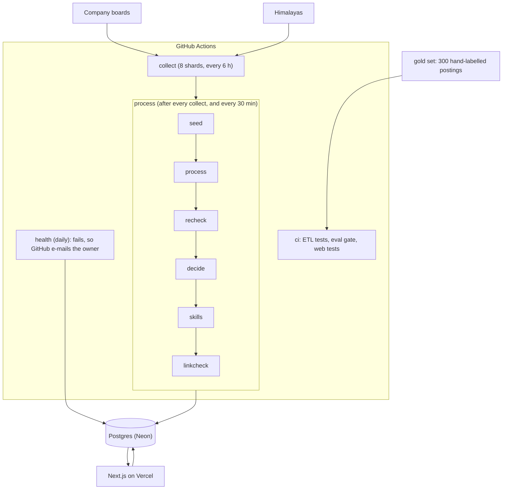

# Architecture

Two deployables share one Postgres database (Neon, schema `hunterrr`): a Python pipeline that runs on GitHub Actions,
and a Next.js app on Vercel. The pipeline writes postings and decisions. The app reads them, and writes only what
belongs to a person (profile, applications, check-ins, reports).

## The pipeline, step by step

| Step | What it does | Safe to run twice? |
|---|---|---|
| `collect` | Polls each board (one request per host per 2 s for aggregators, stop on 429) and stores the raw document | Yes, unchanged documents are skipped by hash |
| `process` | Extraction ladder: JSON-LD, then the board's own fields, then fixed rules, then AI for the rest. Each field stores its provenance. `EXTRACTION_VERSION` says which rules produced it | Yes |
| `recheck` | Re-derives rule-provenance fields for postings extracted by an older version, plus targeted resets of values an old bug stored as "from the board" | Yes |
| `decide` | `etl/decide`: India eligibility (yes / no / unknown, with a reason), employment kind, hard flags, soft labels, role family. Stored with `decision_key` = decision version : extraction version : content hash | Yes, only changed or older postings are decided again |
| `skills` | Skills named by a posting from `config/skills.yaml`, each `must` or `nice`. Stored in `posting_skills` | Yes, keyed by skills version and content hash |
| `linkcheck` | Opens the apply link of postings that would be shown. A link that answers 404 or 410 in two separate runs marks the posting dead. Any other answer changes nothing | Yes |

Order matters: a rule change is a version bump, and the next runs bring every row up to date.

## The decision layer

`etl/decide` is pure code (no database, no network, no AI). `decide(view)` returns the stored fields above. The web app
never recomputes the rules for a decided posting; for a posting not yet decided it falls back to a rule over the
extracted fields, so nothing vanishes while the table fills.

Rules are tuned on the dev labels and judged on holdout labels the rules have never seen. When a holdout posting's miss
has been read it moves to dev and a fresh holdout is labelled. `python -m etl.run eval` prints the score table.
Misses are listed for dev postings only, so the rules are not fitted to the holdout.

## The web app

| Route | Purpose |
|---|---|
| `/today` | The "Apply today" queue (fresh strong and worth-a-shot fits, last 48 h), follow-ups due, applications this week against a goal, the weekly check-in |
| `/jobs` | The ranked feed with fit tabs (Strong fit, Worth a shot, All), filters, an "unconfirmed" view, keyboard j / k |
| `/jobs/[id]` | Why it is on your list, the fit breakdown, key facts with provenance, "I applied" |
| `/tracker` | Saved and applied jobs by stage, notes, reminders |
| `/profile` | Résumé reading, skills, role families, "what to learn next" |
| `/companies`, `/sources` | Employer directory, source health and "wrong?" reports |

Fit score (0 to 100) = skills 40, role 25, level 15, place 10, eligibility 10, pay 5, freshness 5. A part with no
evidence in the posting is left out, listed as "not counted", and never raises the score. A job blocked by a hard rule
is shown capped at 25.

Auth is Better Auth with Google only. Sign-in is limited to the `ALLOWED_EMAILS` list, checked when an account is
created and again on every request, so removing an address locks that person out at once.

## Privacy

`profiles.user_id` and `applications.user_id` (migration 0008) scope every personal query. Application events,
notes, reminders and the weekly check-in follow the application or the user. Job reports and the job data itself are
shared. `web/tests/privacy` runs two users through the same job and checks that neither can read or change the other's
data, including by guessing ids.

## Where to change things

| To change | Edit |
|---|---|
| What counts as open to India | `etl/decide/india.py`, then bump `DECISION_VERSION`, add a labelled posting, run `python -m etl.run eval` |
| How a field is read from text | `etl/extract/rules/*`, then bump `EXTRACTION_VERSION` |
| Companies followed | `config/companies.yaml` (or `python -m etl.run discover "Name" --add`) |
| Skills | `config/skills.yaml`, then `python -m etl.extract.rules.skills --export web/lib/skills/dictionary.json` and bump `SKILLS_VERSION` |
| Database | A new numbered SQL file in `web/drizzle-v2`, written to be safe to run twice |
